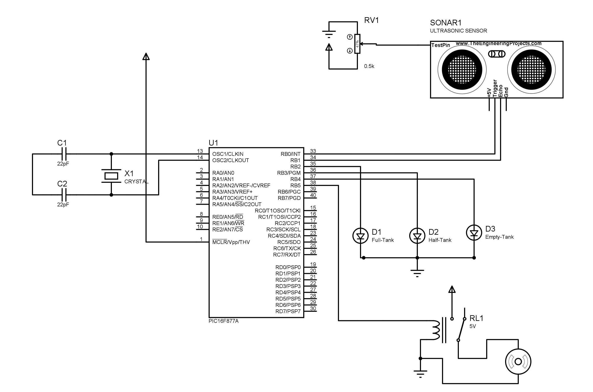
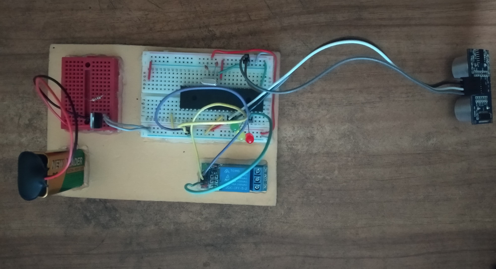

# Automated Water Level Monitor System

## Course : CSE 331 

**Objective :**

The main purpose of this device is to provide its users a hassle free experience. Just install the system once and you are good to go. The device monitors the water level inside your reservoir using Ultrasonic/Sonar sensor & then controls the water pump accordingly.

**Components :**

1. PIC16F877A Microcontroller - 1 Pc 
2. Ultrasonic Sensor - 1 Pc 
3. 5v voltage Regulator (LM7805) - 1 Pc 
4. Crystal oscillator (16 MHz) - 1
5. Capacitors (22pF) - 2Pc
6. Wires
7. LED - 3 Pc
8. 5v Relay - 1 Pc
9. 9v Battery - 1 Pc
10. Breadboard

**Software Used :**
1. Simulation (Proteus)
2. Coding (MikroC)

---

**Simulation Design :**

**Procedure :**

1. We had to setup the ranges (distance) for our water tank using the Ultrasonic sensor. We had three levels: Full, Half and Empty. For fixing up the ranges we used the serial monitor of the Arduino microcontroller and used a piece of code to generate a signal and take the readings.
2. We then made our simulation using the Proteus simulation tool.
3. We wrote the necessary conditions for our system using Mikro C and tested it in our Proteus simulation.
4. After testing the simulation we used the Pic-kit 3 burner to burn our code into the microprocessor 16F877A.
5. The Sonar sensor’s trig pin is connected to the Pic’s RB0 pin as output and echo pin is in RB1 as input.
6. Then the rest of the pins such as RB2, RB3, RB4, RB5 are connect to green led,yellow led,red led and relay.
7. So when the input comes from the sonar to the pic depending on the condition the LED’s and the relay will light up.
8. For testing purposes we considered our water tank to be is total 40 cm.
9. Here we set the lower level from 30 cm to 40 cm which indicates the water level is low and light up only the red led ,also turn on the relay.
10. The Relay (which control 220v AC pump motor) will be turned on until the tank gets full of water. In this case, water and ultrasonic sensor will keep distance of 10 cm. That means, at 10 cm motor/relay will be turned off. Or we can say the tank will be full.
11. The middle level is from 20-29 cm which will light up both yellow and red led but not the relay.
12. Lastly the upper level from 10-19 cm which will light up all the led’s but not the relay as it indicated the tank is full. 

**Image of hardware Implementation :**

**Contribution :**
1. [Badiuzzaman Pranto](https://github.com/prantoamt)
2. [Mostafa Didar](https://github.com/mossydidar)
3. [Mahid Shawon](https://github.com/MahidShawon)

